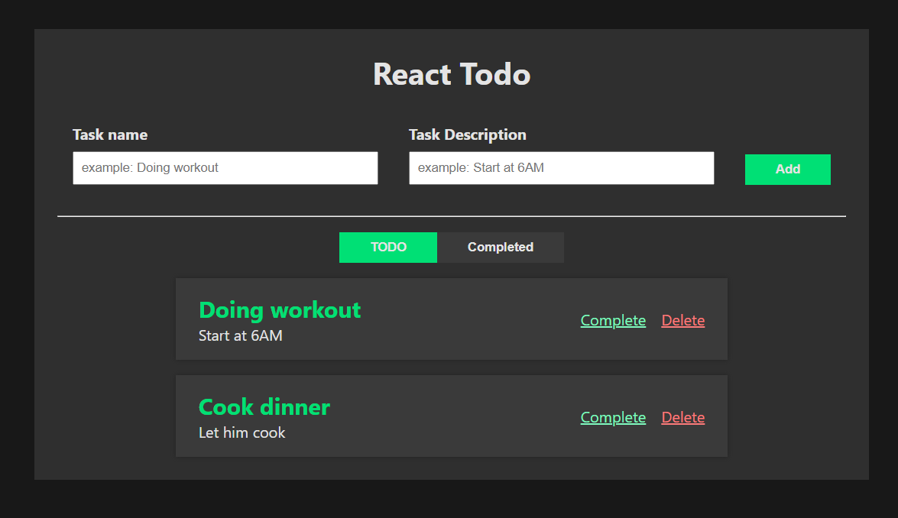

# To-Do List App (React + Vite)

This is a simple React application built with Vite to help you learn key React concepts while managing your tasks.  It allows you to:

* Create new to-do items with descriptions.
* Mark tasks as completed or revert them back to active.
* Archive completed tasks for a cleaner view.
* Delete tasks you no longer need.
* Persist your to-do list in the browser's local storage.

## Screenshot



## Technologies Used

* React
* Vite

## Installation

**Prerequisites:**

* A web browser
* Internet connection (for initial installation)
* A code editor (e.g., Visual Studio Code)

**Steps:**

1. **Clone the project using Git:**

   ```bash
   git clone https://github.com/sandratraniaina/todo-list.git
   ```

2. **Install dependencies:**

   ```bash
   npm install
   ```

3. **Run the development server**:

   ```bash
   npm run dev
   ```

   **This will start the development server and open** the application in your default browser.

## Usage

The application is straightforward to use:

* Enter a task name and description in the input field and click "Add" to create a new to-do item.
* Click the "Complete" button to remove a completed task from the main view.
* Click the "Revert" button (available for archived tasks) to move it back to the active list.
* Click the "Delete" button to a task to delete it permanently.

## Contributing

We welcome contributions to improve this project! You can **fork the repository, make changes, and submit a pull request.**

## License

This project is licensed under the MIT License. See the [LICENSE](./LICENSE) file for details.

## Contact

**If you have any questions or suggestions, feel free to contact** me at [sandratrarafagmail.com](sandratrarafagmail.com).
